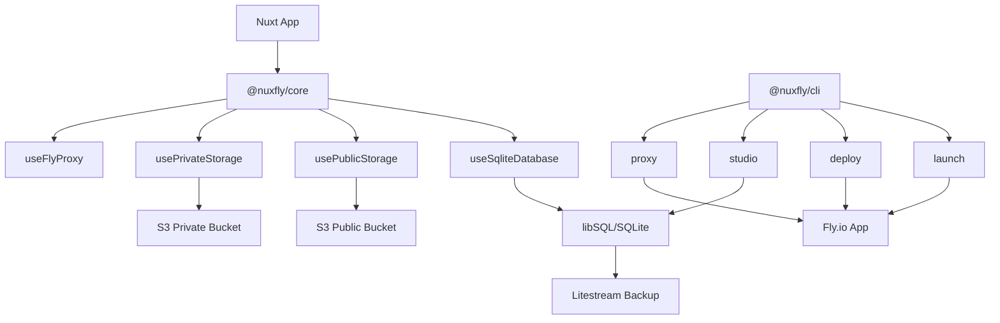

# Getting Started

> Deploy your Nuxt applications to Fly.io with integrated SQLite database and S3-compatible storage.

## Overview

Nuxfly is a comprehensive toolkit for deploying Nuxt applications to [Fly.io](https://fly.io) with built-in support for:

- 🚀 **One-command deployment** - Deploy Nuxt apps to Fly.io with automatic infrastructure setup
- 🗄️ **SQLite integration** - Automatic SQLite database continuous backup (default 30 seconds) **and** auto-restore via Litestream
- 🌧 **Drizzle integration** - Automatically applies Drizzle migrations on deployment
- 📦 **Tigris (S3) storage** - Zero configuration to provision and access public and private file storage buckets
- 🔄 **Import existing apps** - Seamlessly import and configure existing Fly.io applications
- 🔧 **Database management** - Integrated Drizzle Studio for database operations

The toolkit consists of two main packages:

- **[@nuxfly/core](https://www.npmjs.com/package/@nuxfly/core)** - Nuxt module with runtime composables
- **[@nuxfly/cli](https://www.npmjs.com/package/@nuxfly/cli)** - Command-line interface for deployment

::warning
The SQLite database is intended for small to medium workloads and does **not** support horizontal scaling. Without further work to support horizontal scaling, the
database is limited to running on a single Fly machine so you must scale it by increasing the machine size. Also, there is no machine or volume redundancy, so
if the Fly machine fails, the volume data could be lost. In this case, your database will be restored from the last Litestream backup automatically, but any data
written since then will be lost (default up to 30 seconds). This is **not** a true "high availability" setup, but does still provide a fairly durable and low-maintenance
solution for your app at a low operating cost. If these trade-offs are not acceptable for your use case, consider using a managed database service, instead such as
Fly Postgres or Neon (also Postgres).
::

## Quick Start

::note
The public source code of this project includes a "Playground" app, [here](https://github.com/colinmollenhour/nuxfly/tree/main/playground), which has a good
reference implementation, complete with an automatically provisioned Minio server for S3 storage via `docker-compose.yml`.
::

### 1. Install the CLI

:pm-install{name="@nuxfly/cli" dev=false global=true}

### 2. Install the Nuxt Module

In your Nuxt project:

:pm-install{name="@nuxfly/core"}

### 3. Add the Module

Add the module to your `nuxt.config.ts`:

```typescript
export default defineNuxtConfig({
  modules: ['@nuxfly/core'],
  nuxfly: {
    litestream: true,      // Enable SQLite with Litestream backup
    publicStorage: true,   // Enable public S3 storage
    privateStorage: true,  // Enable private S3 storage
  }
})
```

### 4. Launch Your App

Initialize and deploy your application:

```bash
nuxfly launch
```

This command will:
- Create a new Fly.io application
- Set up SQLite database with Litestream backup
- Configure S3-compatible storage buckets
- Generate deployment files (creates `fly.toml` for production)
- Deploy your application

### 5. Multi-Environment Setup (Optional)

For staging, development, or other environments:

```bash
# Create staging environment
export NUXFLY_ENV=staging
nuxfly launch --name my-app-staging

# Create development environment
export NUXFLY_ENV=development
nuxfly launch --name my-app-dev

# Deploy to specific environments
NUXFLY_ENV=staging nuxfly deploy
NUXFLY_ENV=development nuxfly deploy
```

This creates environment-specific files like `fly.staging.toml`, `fly.development.toml`.

## What's Next?

::card-group
  ::card
  ---
  title: 'Nuxt Module'
  to: '/module'
  icon: 'i-heroicons-cube'
  ---
  Learn about the Nuxt module and its composables for database and storage access.
  ::
  ::card
  ---
  title: 'CLI Commands'
  to: '/cli'
  icon: 'i-heroicons-command-line'
  ---
  Explore all available CLI commands for deployment, development, and management.
  ::
::

## Features

### 🗄️ SQLite Database
- Integrated [libSQL](https://github.com/tursodatabase/libsql) client
- Automatic Litestream backup to S3 (edit `.nuxfly/litestream.yml` for advanced configuration)
- `useSqliteDatabase()` composable for easy access

### 📁 S3-Compatible Storage
- Public and private storage buckets
- Minio client integration
- `usePublicStorage()` and `usePrivateStorage()` composables

### 🚀 Zero-Config Deployment
- Automatic Fly.io app creation
- Generated Dockerfile and fly.toml
- Integrated CI/CD support

### 🛠️ Development Tools
- Database studio with secure tunneling
- Proxy commands for local development
- Hot reload support

## Requirements

- [Node.js](https://nodejs.org/) 18+
- [Fly.io CLI](https://fly.io/docs/hands-on/install-flyctl/) installed and authenticated
- [Nuxt 3](https://nuxt.com/) project

## Environment Variables

### `NUXFLY_ENV`
Specifies which environment configuration to use:
- **Not required** for single-environment projects (only `fly.toml`)
- **Required** for multi-environment projects (when `fly.*.toml` files exist)
- **Values**: `prod` (default), `staging`, `development`, or any custom environment name

### `FLY_ACCESS_TOKEN`
Your Fly.io access token for CI/CD deployments.

## Architecture



:read-more{to="/module"}
:read-more{to="/cli"}
